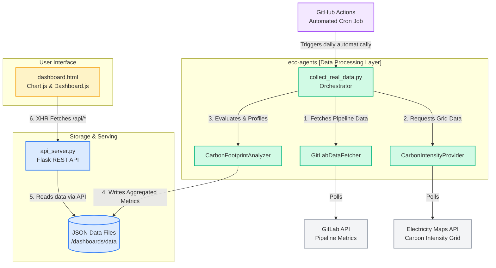

# 🌍 EcoGuard — Complete End-to-End Architecture

EcoGuard is an intelligent GreenOps platform that continuously monitors and minimizes the environmental impact of your software development lifecycle. Here is exactly how all the moving parts connect together end-to-end.

---

## 🏗️ High-Level System Architecture

The project runs on a 5-pillar architecture:
1. **External Data Sources** (APIs)
2. **EcoGuard Agents** (Data Collection & Processing)
3. **Storage & Serving** (JSON & Flask API)
4. **Visual Dashboard** (Frontend UI)
5. **CI/CD Automation** (GitHub Actions)

### 📊 System Diagram

---

## ⚙️ How Each Layer Works

### 1. External Data Services (The Inputs)
* **GitLab API**: Requires the `GITLAB_TOKEN`. Exposed via `https://gitlab.com/api/v4/projects/{id}/pipelines`. Provides the precise job execution times and states.
* **Electricity Maps API**: Requires the `ELECTRICITY_MAPS_API_KEY`. Takes a zone (like `IN` -> `IN-WE`) and provides the live grams of CO₂ emitted per kWh of electricity right now in that physical location.

### 2. The Python Agents Layer (The Brain)
* **`collect_real_data.py`**: The root entry script that runs everything.
* **`GitLabDataFetcher`**: Because GitLab doesn't easily expose CPU/Memory for free tiers, this class maps stages (like `build`, `test`, `deploy`) to **heuristic server profiles** (e.g., *builds use 2 CPUs, deployments use 1 CPU*). By multiplying the CPU footprint by the exact duration in seconds, it tracks precise energy usage in `kWh`.
* **`CarbonIntensityProvider`**: Marries the `kWh` to the live data from Electricity Maps to output absolute `kg CO₂e` emissions.
* **Optimization Analyzers**: Recommends if pipelines should run at a different time of day when grids are greener.

### 3. File Storage & Backend API
* **Data Sink**: Metrics are structured into temporal JSON files (`daily-metrics.json`, `weekly-metrics.json`, etc.) acting as a lightweight NoSQL database. No heavy SQL servers are required.
* **`api_server.py`**: A `Flask` backend running on `localhost:5000` that loads these static JSON files, attaches CORS headers, and dynamically serves them under protected `/api/...` routes. It also natively serves the UI endpoints.

### 4. The Interactive Dashboard
* **Dynamic Frontend**: A lightweight HTML/CSS/JS frontend located in `/public`. 
* When you open the dashboard, `dashboard.js` pings `/api/daily-metrics` and `summary.json`. 
* Uses **Chart.js** to map historical emissions visually, highlighting precisely which jobs cause the largest carbon spike. 

### 5. Automation Layer (GitHub Actions)
* Without this, the system represents "stale" state. To make it a living dashboard, `.github/workflows/update-dashboard.yml` is used.
* **The Routine**: Every 24 hours at 00:00 UTC, a GitHub Ubuntu runner creates a sandbox, securely grabs your secret tokens, and triggers the Python agents.
* **The Push**: The newly calculated data is programmatically `git commit`'ed and pushed back into the `main` branch. This makes your Git Repository the absolute source of truth without ever needing an external database.

---

### 🔥 Summary of Data Flow Life cycle
1. Code is pushed 
2. ➡️ GitHub Action triggers at midnight 
3. ➡️ Agents request job durations from GitLab 
4. ➡️ Agents request live Carbon Data from Electricity Maps 
5. ➡️ Calculate Total Footprint 
6. ➡️ Output to JSON 
7. ➡️ Commit back to GitHub 
8. ➡️ Flask serves JSON to Dashboard UI 
9. ➡️ You view clean charts!
