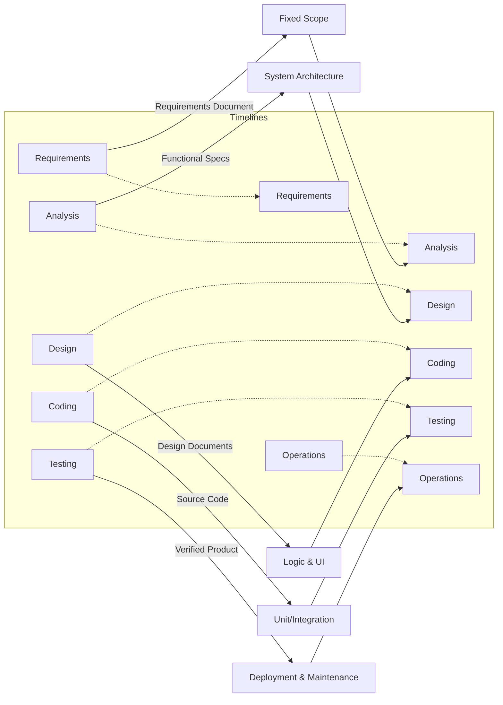
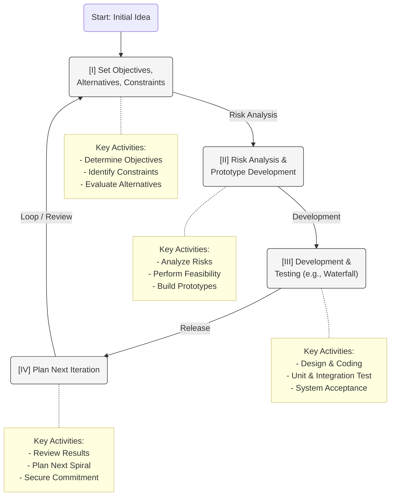
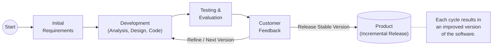
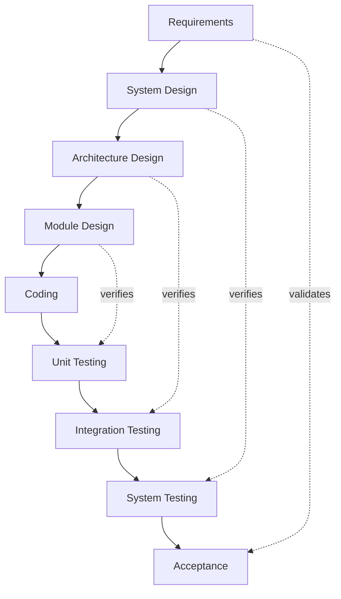

# Software Development Life Cycle (SDLC) Models

This document outlines the detailed conceptual SDLC models used in software development processes.

## Waterfall Model

## Spiral Model (Boehm)

## Evolutionary Development Model

## V-Model (Software Development Life Cycle)

