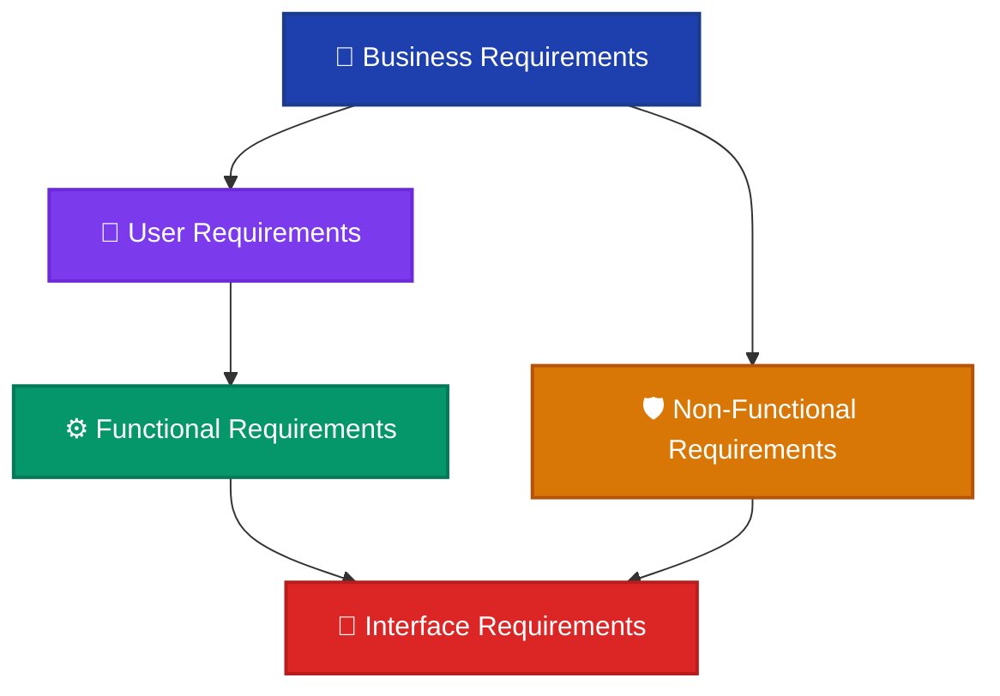
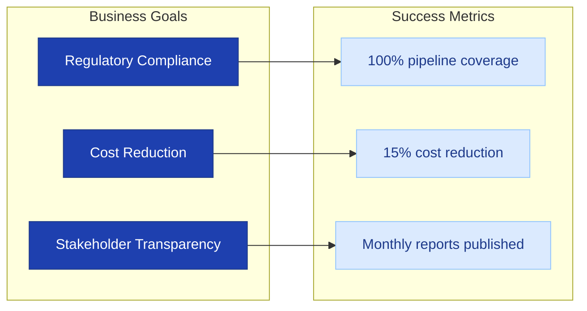
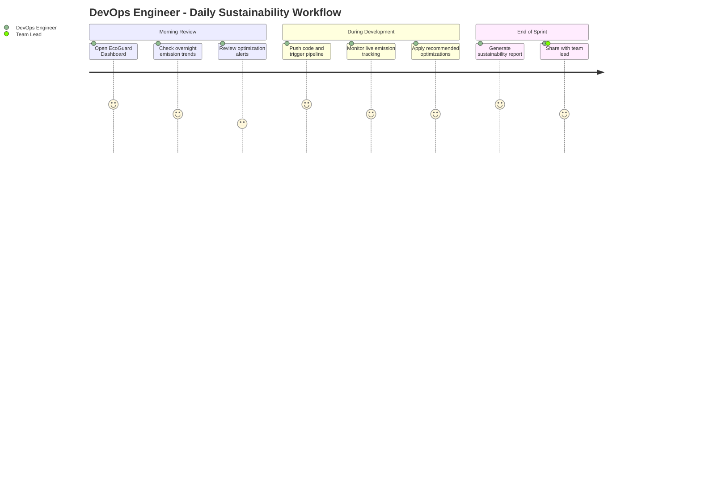
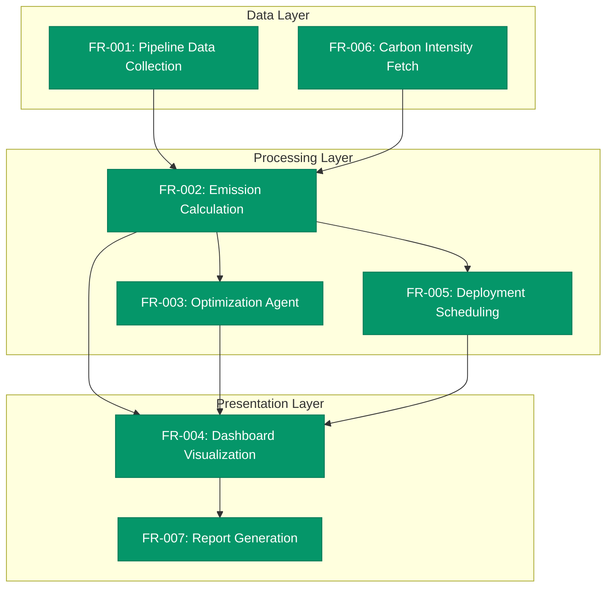
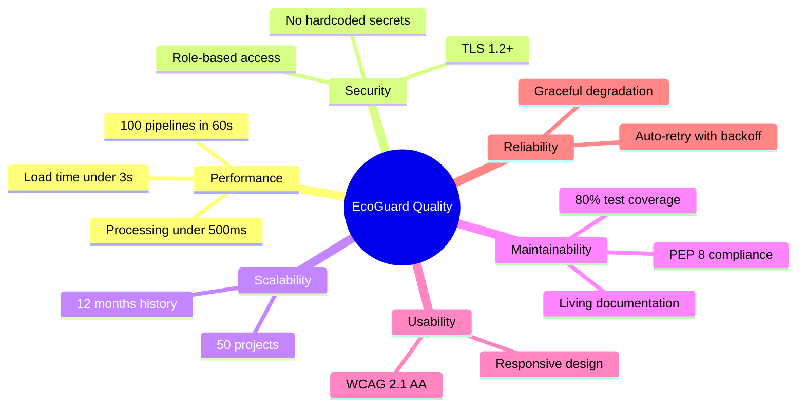
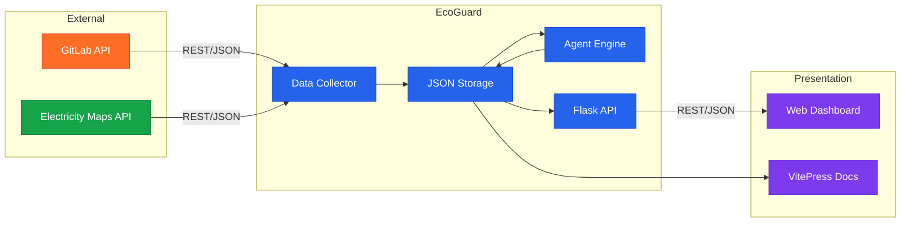
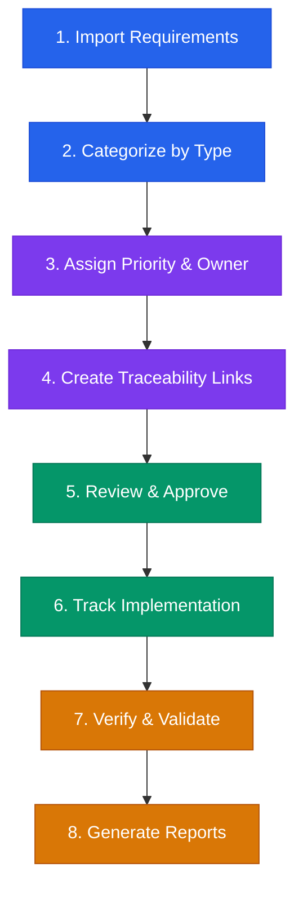
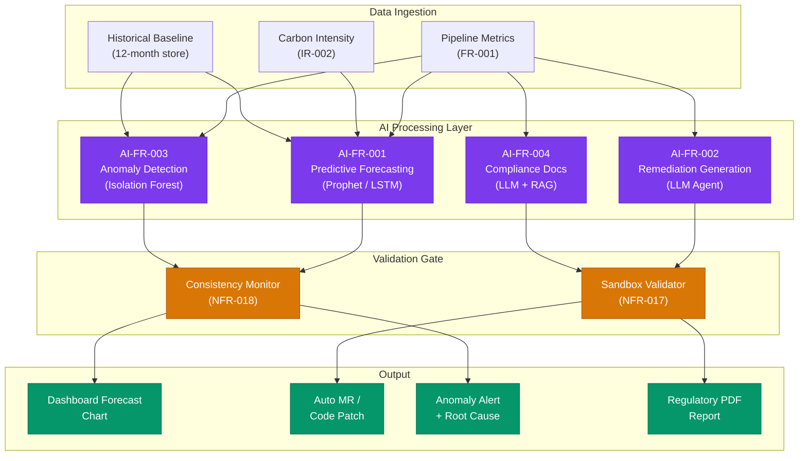

# Software Requirements Specification (SRS)

  
📄 SRS Document

  <h2 class="srs-hero-title">A comprehensive requirements specification for the EcoGuard sustainability platform</h2>
  

    This document defines every layer of requirements — from high-level business goals down to interface contracts — following IEEE 830 standards and managed through <strong>OSRMT</strong> (Open-Source Requirements Management Tool).
  

---

## 📐 Requirements Hierarchy

The diagram below illustrates how the five requirement types relate to each other, flowing from strategic business needs down to technical interface contracts.

Each level adds specificity. Business Requirements define **why** the system exists, User Requirements define **what** users need, Functional Requirements define **how** the system behaves, Non-Functional Requirements define **how well** it performs, and Interface Requirements define **how it connects** to external systems.

---

## 🏢 1. Business Requirements

Business requirements capture the high-level objectives that justify the project's existence. They are defined by executive stakeholders and drive every downstream decision.

  <h3>BR-001: Sustainability Compliance</h3>
  
<strong>Description:</strong> EcoGuard shall enable organizations to measure, track, and report the carbon footprint of their CI/CD pipelines in compliance with emerging EU sustainability reporting directives.

  
<strong>Priority:</strong> Critical

  
<strong>Rationale:</strong> Regulatory bodies are increasingly requiring digital sustainability reporting. Failure to comply exposes organizations to legal and reputational risk.

  <h3>BR-002: Cost Optimization</h3>
  
<strong>Description:</strong> The platform shall identify resource inefficiencies in pipeline execution and recommend optimizations that reduce both compute costs and energy consumption by at least 15%.

  
<strong>Priority:</strong> High

  
<strong>Rationale:</strong> Cloud compute costs are a major operational expense. Aligning cost reduction with sustainability creates a dual incentive for adoption.

  <h3>BR-003: Transparent Reporting</h3>
  
<strong>Description:</strong> EcoGuard shall produce clear, auditable sustainability dashboards and reports suitable for both internal engineering teams and external stakeholders.

  
<strong>Priority:</strong> High

  
<strong>Rationale:</strong> Transparency builds trust with customers, investors, and regulatory bodies.

### Business Requirements Traceability

---

## 👤 2. User Requirements

User requirements describe the system from the perspective of the people who will interact with it. They define expected behaviors in natural language.

  <h3>UR-001: View Emission Trends</h3>
  
<strong>Actor:</strong> DevOps Engineer

  
<strong>Description:</strong> As a DevOps engineer, I want to view CO₂ emission trends for my pipelines over the past 30 days so that I can identify which jobs are the biggest contributors.

  
<strong>Acceptance Criteria:</strong>

  <ul>
    <li>Dashboard displays a line chart of daily emissions</li>
    <li>User can filter by project, branch, or job name</li>
    <li>Data refreshes within 5 minutes of pipeline completion</li>
  </ul>

  <h3>UR-002: Receive Optimization Alerts</h3>
  
<strong>Actor:</strong> Team Lead

  
<strong>Description:</strong> As a team lead, I want to receive alerts when a pipeline exceeds emission thresholds so that I can prioritize optimization before the next sprint.

  
<strong>Acceptance Criteria:</strong>

  <ul>
    <li>Configurable threshold per project (kg CO₂ per build)</li>
    <li>Alerts delivered via GitLab notification and email</li>
    <li>Alert includes specific job and recommended action</li>
  </ul>

  <h3>UR-003: Generate Compliance Reports</h3>
  
<strong>Actor:</strong> Sustainability Officer

  
<strong>Description:</strong> As a sustainability officer, I want to generate monthly compliance reports with one click so that I can submit them to regulatory bodies without manual data aggregation.

  
<strong>Acceptance Criteria:</strong>

  <ul>
    <li>Report includes total emissions, energy usage, and trend analysis</li>
    <li>Exportable as PDF and CSV</li>
    <li>Signed with generation timestamp for audit trail</li>
  </ul>

### User Journey Map

---

## ⚙️ 3. Functional Requirements

Functional requirements define the specific behaviors, features, and functions the system must perform.

  <h3>FR-001: Pipeline Data Collection</h3>
  
<strong>Traces to:</strong> UR-001, BR-001

  
<strong>Description:</strong> The system shall automatically collect job-level metadata (duration, runner type, resource usage) from GitLab CI/CD pipelines via the GitLab REST API.

  
<strong>Input:</strong> GitLab project ID, API token

  
<strong>Output:</strong> Structured JSON containing job metrics per pipeline run

  
<strong>Processing:</strong>

  <ol>
    <li>Query <code>/api/v4/projects/:id/pipelines</code> for recent pipelines</li>
    <li>For each pipeline, fetch individual job details</li>
    <li>Extract duration, runner tags, artifacts size, and status</li>
    <li>Store normalized data in <code>dashboards/data/</code></li>
  </ol>

  <h3>FR-002: Carbon Emission Calculation</h3>
  
<strong>Traces to:</strong> UR-001, BR-001

  
<strong>Description:</strong> The system shall calculate CO₂ emissions for each pipeline job using the formula:

  

    CO₂ (kg) = Energy (kWh) × Carbon Intensity (gCO₂/kWh) ÷ 1000
  

  
Where Energy = Duration (hours) × Power Draw (kW) and Carbon Intensity is fetched from the Electricity Maps API for the runner's region.

  <h3>FR-003: Optimization Agent</h3>
  
<strong>Traces to:</strong> UR-002, BR-002

  
<strong>Description:</strong> The system shall analyze pipeline efficiency and generate actionable recommendations including:

  <ul>
    <li>Parallelization opportunities for sequential jobs</li>
    <li>Cache optimization for repeated dependency installations</li>
    <li>Runner right-sizing based on actual CPU/memory utilization</li>
    <li>Scheduling non-urgent jobs during low carbon intensity windows</li>
  </ul>

  <h3>FR-004: Dashboard Visualization</h3>
  
<strong>Traces to:</strong> UR-001, UR-003, BR-003

  
<strong>Description:</strong> The system shall render interactive dashboards with the following views:

  <ul>
    <li>Daily/weekly/monthly emission trend charts</li>
    <li>Per-project and per-job breakdowns</li>
    <li>Sustainability goal progress indicators</li>
    <li>Carbon intensity heatmap by time of day</li>
  </ul>

  <h3>FR-005: Eco-Friendly Deployment Scheduling</h3>
  
<strong>Traces to:</strong> BR-001, BR-002

  
<strong>Description:</strong> The system shall recommend optimal deployment windows based on forecasted grid carbon intensity. When carbon intensity exceeds a configurable threshold, the system shall suggest delaying non-critical deployments.

### Functional Decomposition

---

## 🛡️ 4. Non-Functional Requirements (NFRs)

Non-functional requirements define the quality attributes and constraints that the system must satisfy.

  

    <h3>⚡ Performance</h3>
    <table>
      <tr><td><strong>NFR-001</strong></td><td>Dashboard shall load within 3 seconds on a standard broadband connection</td></tr>
      <tr><td><strong>NFR-002</strong></td><td>Data collection for 100 pipelines shall complete within 60 seconds</td></tr>
      <tr><td><strong>NFR-003</strong></td><td>Emission calculations shall process within 500ms per job</td></tr>
    </table>
  

  

    <h3>🔒 Security</h3>
    <table>
      <tr><td><strong>NFR-004</strong></td><td>GitLab API tokens shall be stored as environment variables, never in source code</td></tr>
      <tr><td><strong>NFR-005</strong></td><td>All external API calls shall use HTTPS/TLS 1.2+</td></tr>
      <tr><td><strong>NFR-006</strong></td><td>Dashboard access shall respect GitLab project-level permissions</td></tr>
    </table>
  

  

    <h3>📈 Scalability</h3>
    <table>
      <tr><td><strong>NFR-007</strong></td><td>System shall handle data from up to 50 concurrent GitLab projects</td></tr>
      <tr><td><strong>NFR-008</strong></td><td>Historical data storage shall support at least 12 months of metrics</td></tr>
    </table>
  

  

    <h3>🔧 Maintainability</h3>
    <table>
      <tr><td><strong>NFR-009</strong></td><td>Codebase shall maintain a minimum of 80% test coverage</td></tr>
      <tr><td><strong>NFR-010</strong></td><td>All Python modules shall follow PEP 8 style guidelines</td></tr>
      <tr><td><strong>NFR-011</strong></td><td>Documentation shall be updated alongside every feature change</td></tr>
    </table>
  

  

    <h3>♿ Usability</h3>
    <table>
      <tr><td><strong>NFR-012</strong></td><td>Dashboard shall be responsive and usable on screens from 375px to 2560px</td></tr>
      <tr><td><strong>NFR-013</strong></td><td>Color palette shall meet WCAG 2.1 AA contrast standards</td></tr>
    </table>
  

  

    <h3>🔄 Reliability</h3>
    <table>
      <tr><td><strong>NFR-014</strong></td><td>System shall gracefully degrade if external APIs are unavailable</td></tr>
      <tr><td><strong>NFR-015</strong></td><td>Failed data collection jobs shall retry up to 3 times with exponential backoff</td></tr>
    </table>
  

### NFR Quality Model

---

## 🔌 5. Interface Requirements

Interface requirements define how EcoGuard connects to external systems, APIs, and user-facing surfaces.

### 5.1 External API Interfaces

  <h3>IR-001: GitLab REST API</h3>
  
<strong>Direction:</strong> EcoGuard → GitLab

  
<strong>Protocol:</strong> HTTPS REST (JSON)

  
<strong>Authentication:</strong> Personal Access Token (PAT) via <code>GITLAB_TOKEN</code> environment variable

  
<strong>Endpoints Used:</strong>

  <ul>
    <li><code>GET /api/v4/projects/:id/pipelines</code> — List pipeline runs</li>
    <li><code>GET /api/v4/projects/:id/pipelines/:pipeline_id/jobs</code> — Job details</li>
    <li><code>GET /api/v4/projects/:id/issues</code> — Compliance issue tracking</li>
    <li><code>POST /api/v4/projects/:id/issues</code> — Create optimization recommendations</li>
  </ul>
  
<strong>Rate Limits:</strong> Respects GitLab rate limit headers; implements retry with <code>Retry-After</code> header.

  <h3>IR-002: Electricity Maps API</h3>
  
<strong>Direction:</strong> EcoGuard → Electricity Maps

  
<strong>Protocol:</strong> HTTPS REST (JSON)

  
<strong>Authentication:</strong> API key via <code>ELECTRICITY_MAPS_API_KEY</code> environment variable

  
<strong>Endpoints Used:</strong>

  <ul>
    <li><code>GET /v3/carbon-intensity/latest</code> — Current carbon intensity by zone</li>
    <li><code>GET /v3/carbon-intensity/forecast</code> — 72-hour forecast for deployment scheduling</li>
  </ul>
  
<strong>Fallback:</strong> If the API is unavailable, use a default carbon intensity of 475 gCO₂/kWh (global average).

### 5.2 Internal Interfaces

  <h3>IR-003: Flask API Server</h3>
  
<strong>Direction:</strong> Dashboard ↔ Backend

  
<strong>Protocol:</strong> HTTP REST (JSON)

  
<strong>Endpoints:</strong>

  <ul>
    <li><code>GET /api/metrics/daily</code> — Daily metrics summary</li>
    <li><code>GET /api/metrics/weekly</code> — Weekly metrics summary</li>
    <li><code>GET /api/metrics/monthly</code> — Monthly metrics summary</li>
    <li><code>GET /api/summary</code> — Overall project summary</li>
    <li><code>GET /api/goals</code> — Sustainability goal progress</li>
  </ul>

### 5.3 User Interface

  <h3>IR-004: Web Dashboard</h3>
  
<strong>Technology:</strong> HTML5, CSS3, JavaScript with Chart.js / D3.js

  
<strong>Supported Browsers:</strong> Chrome 90+, Firefox 88+, Safari 14+, Edge 90+

  
<strong>Responsive Breakpoints:</strong>

  <ul>
    <li>Mobile: 375px – 768px</li>
    <li>Tablet: 769px – 1024px</li>
    <li>Desktop: 1025px+</li>
  </ul>

### Interface Architecture

---

## 🔧 Requirements Management with OSRMT

**OSRMT (Open-Source Requirements Management Tool)** is used to gather, organize, trace, and validate all requirements throughout the project lifecycle.

### Why OSRMT?

  

    <h3>📋 Structured Capture</h3>
    
OSRMT provides a tree-based hierarchy to organize requirements into categories (Business, User, Functional, NFR, Interface) with unique identifiers for traceability.

  

  

    <h3>🔗 Traceability Matrix</h3>
    
Every requirement is linked to its parent (upstream traceability) and its implementation artifacts like test cases and code modules (downstream traceability).

  

  

    <h3>📊 Change Tracking</h3>
    
OSRMT logs every modification with timestamps, authors, and justifications — creating a complete audit trail for compliance and review.

  

  

    <h3>✅ Validation & Verification</h3>
    
Requirements are tagged with validation status (Draft → Reviewed → Approved → Implemented → Verified) to track progress through the lifecycle.

  

### OSRMT Workflow for EcoGuard

### Full Traceability Matrix

| Req ID | Type | Traces To | Status | Owner |
|---|---|---|---|---|
| BR-001 | Business | UR-001, UR-003 | Approved | Product Owner |
| BR-002 | Business | UR-002 | Approved | Product Owner |
| BR-003 | Business | UR-003 | Approved | Product Owner |
| UR-001 | User | FR-001, FR-002, FR-004 | Approved | DevOps Lead |
| UR-002 | User | FR-003 | Approved | DevOps Lead |
| UR-003 | User | FR-004, FR-007 | Approved | Sustainability Officer |
| FR-001 | Functional | IR-001 | Implemented | Backend Dev |
| FR-002 | Functional | IR-001, IR-002 | Implemented | Backend Dev |
| FR-003 | Functional | — | Implemented | Backend Dev |
| FR-004 | Functional | IR-003, IR-004 | Implemented | Frontend Dev |
| FR-005 | Functional | IR-002 | Implemented | Backend Dev |
| NFR-001 | Non-Functional | FR-004 | Verified | QA Lead |
| NFR-004 | Non-Functional | IR-001, IR-002 | Verified | Security Lead |
| IR-001 | Interface | FR-001, FR-002 | Verified | Backend Dev |
| IR-002 | Interface | FR-002, FR-005 | Verified | Backend Dev |

---

## 🤖 6. AI-Assisted Requirements (Comparison)

To enhance the system's capabilities beyond manual rule-based logic, the following AI-assisted requirements are introduced to compare against traditional manual features. These features aim to reduce human bottleneck by automating complex pattern recognition and code modification.

> **AI-Assisted vs. Manual:** Each AI requirement below directly supersedes or augments a manual requirement, offering greater adaptability, speed, and scale — at the cost of added complexity, compute overhead, and governance concerns.

  <h3>AI-FR-001: Predictive Emission Forecasting</h3>
  
<strong>Compared to:</strong> Manual trend review (UR-001)

  
<strong>Description:</strong> Instead of relying solely on past data visualization for manual review, the system shall utilize machine learning models (e.g., LSTM time-series or Prophet) to forecast future carbon emissions up to 7 days ahead. This includes predicting energy spikes during seasonal traffic increases, large code branch merges, or scheduled release cycles.

  
<strong>Input:</strong> Historical emission time-series data per project (minimum 30 days), runner metadata, calendar events

  
<strong>Output:</strong> Probabilistic emission forecast with confidence intervals, surfaced in the dashboard and triggering pre-emptive scheduling recommendations

  
<strong>Acceptance Criteria:</strong>

  <ul>
    <li>Forecasts shall achieve a Mean Absolute Percentage Error (MAPE) ≤ 15% on a rolling 7-day horizon</li>
    <li>Predictions are refreshed automatically after each new pipeline run completes</li>
    <li>A confidence band (80% interval) must accompany every forecast shown in the UI</li>
    <li>If training data is insufficient (&lt; 30 data points), the system shall display a manual trend chart and suppress AI forecasts</li>
  </ul>
  
<strong>AI Technology:</strong> Facebook Prophet / LSTM via scikit-learn or TensorFlow Lite; model artifacts versioned in the repository

  
<strong>NFR References:</strong> NFR-016 (determinism), NFR-018 (benchmarking)

  <h3>AI-FR-002: Intelligent Remediation Generation</h3>
  
<strong>Compared to:</strong> Static Optimization Agent (FR-003)

  
<strong>Description:</strong> While the manual agent highlights issues via static rules, the AI-assisted system shall employ an LLM-based agent (e.g., GitLab Duo / OpenAI GPT-4o) to contextualize pipeline failures and inefficiencies. It must generate automated merge requests with context-aware, code-level optimizations — rewriting `.gitlab-ci.yml` and Dockerfile configurations — to directly reduce the carbon footprint without requiring a developer's initial draft.

  
<strong>Input:</strong> Raw `.gitlab-ci.yml` content, job duration logs, CPU/memory utilization metrics, identified inefficiency categories from FR-003

  
<strong>Output:</strong> A fully formed merge request containing patched CI/CD configuration files, inline comments explaining each change, and an estimated emission reduction percentage

  
<strong>Acceptance Criteria:</strong>

  <ul>
    <li>Generated merge requests must pass automated CI syntax validation before being opened</li>
    <li>Each MR description must include a carbon saving estimate (kg CO₂) and a confidence score</li>
    <li>Remediation suggestions must not remove any job flagged as a required status check</li>
    <li>Human approval is mandatory before any AI-generated MR is merged (human-in-the-loop gate)</li>
    <li>The system shall achieve ≥ 70% MR acceptance rate measured over a rolling 30-day window</li>
  </ul>
  
<strong>AI Technology:</strong> LLM API (GitLab Duo / OpenAI GPT-4o) with structured output / function calling; prompt templates version-controlled

  
<strong>NFR References:</strong> NFR-017 (sandboxed fallback), NFR-018 (benchmarking)

  <h3>AI-FR-003: Dynamic Anomaly Detection</h3>
  
<strong>Compared to:</strong> Static Threshold Alerts (UR-002)

  
<strong>Description:</strong> Rather than relying on rigid, pre-configured high-emission thresholds, the system shall train an unsupervised anomaly detection model (e.g., Isolation Forest or DBSCAN) on the historical baseline behaviour of each specific CI/CD pipeline. Alerts are raised automatically for statistically anomalous deviations, adapting to evolving pipeline structures without manual threshold updates.

  
<strong>Input:</strong> Per-job emission time-series, pipeline structural metadata (job count, parallelism), runner utilization rates

  
<strong>Output:</strong> Anomaly score per pipeline run (0–1), binary alert flag, and a human-readable root-cause hypothesis surfaced to the team lead

  
<strong>Acceptance Criteria:</strong>

  <ul>
    <li>Model retrains automatically every 7 days or after 500 new pipeline runs, whichever comes first</li>
    <li>False-positive rate shall remain below 10% measured against a manually labelled validation set</li>
    <li>Anomaly alerts must fire within 5 minutes of pipeline completion (same as UR-001 data freshness SLA)</li>
    <li>The system must surface the top-3 contributing jobs to each anomaly in the alert payload</li>
    <li>Baseline model bootstrapping requires a minimum of 50 pipeline runs; system falls back to static thresholds during the cold-start period</li>
  </ul>
  
<strong>AI Technology:</strong> scikit-learn Isolation Forest; model serialized with joblib and stored in <code>models/</code>

  
<strong>NFR References:</strong> NFR-016 (determinism), NFR-017 (fallback), NFR-018 (benchmarking)

  <h3>AI-FR-004: Context-Aware Documentation & Compliance</h3>
  
<strong>Compared to:</strong> Manual Report Generation (UR-003)

  
<strong>Description:</strong> The system shall auto-generate detailed, narrative-driven compliance reports formatted specifically for varying regulatory bodies (EU CSRD, ISO 14064, GHG Protocol). An LLM layer translates raw emission metrics into structured audit narratives, shifting the manual burden of compiling different data sets for different audits entirely to AI.

  
<strong>Input:</strong> Aggregated monthly emission metrics, sustainability goals progress data, regulatory body selector (EU / ISO / GHG), organization profile

  
<strong>Output:</strong> A formatted PDF/DOCX report with executive summary, data tables, trend narrative, methodology disclosure, and digital audit signature

  
<strong>Acceptance Criteria:</strong>

  <ul>
    <li>Report must be generated and available for download within 60 seconds of user request</li>
    <li>All numerical data in the narrative must be validated against the source JSON with a ±0.01 kg CO₂ tolerance — no AI hallucination of figures permitted</li>
    <li>Every report shall include a machine-readable JSON-LD metadata block for automated regulatory ingestion</li>
    <li>The system shall support at minimum three output formats: PDF, DOCX, and CSV</li>
    <li>Narrative text quality shall be reviewed via automated Flesch-Kincaid readability scoring (target grade level ≤ 12)</li>
  </ul>
  
<strong>AI Technology:</strong> LLM with retrieval-augmented generation (RAG) over the organization's emission data; output grounded and fact-checked before rendering

  
<strong>NFR References:</strong> NFR-016 (determinism), NFR-017 (sandboxed fallback)

### AI Requirements Lifecycle Flow

---

## ⚖️ 7. Conclusion: Manual vs. AI-Assisted Execution

When evaluating the platform's execution, there are distinct trade-offs between manual (rule-based) approaches and AI-assisted workflows. A successful implementation requires balancing the precision of manual rules with the adaptability of AI. The conclusions drawn below are informed by the four paired requirement comparisons documented in Section 6.

  

    <h3>📉 Limitations of Manual Execution</h3>
    <ul>
      <li><strong>Scalability lag:</strong> Manual review of pipeline emissions becomes unmanageable across hundreds of repositories. Team leads simply cannot review every job log.</li>
      <li><strong>Cognitive Overload:</strong> Engineers are forced to interpret raw data and manually translate insights into code changes — a high-effort, low-leverage activity.</li>
      <li><strong>Static Rules:</strong> Heuristics for optimization cannot adapt to unique pipeline structures without constant, labor-intensive human updates.</li>
      <li><strong>Delayed Action:</strong> Reporting and remediation completely depend on human time availability, drastically delaying potential energy savings.</li>
      <li><strong>Threshold Drift:</strong> Manually configured emission thresholds become stale as pipelines evolve, leading to alert fatigue from false positives or missed anomalies.</li>
      <li><strong>Inconsistent Reporting Quality:</strong> Human-compiled compliance documents vary in structure, depth, and language across reporters, creating audit trail inconsistencies.</li>
    </ul>
  

  

    <h3>⚠️ Limitations of AI-Assisted Execution</h3>
    <ul>
      <li><strong>Consistency lag:</strong> AI models exhibit non-deterministic behavior, proposing completely different code optimizations for the exact same pipeline data over time.</li>
      <li><strong>Compute Overhead:</strong> Running LLMs for code optimization generates its own severe carbon footprint, which can ironically outweigh the pipeline energy savings if not metered carefully.</li>
      <li><strong>Hallucinations:</strong> The AI may confidently suggest invalid configuration changes that structurally break CI/CD pipelines or fabricate emission figures in reports.</li>
      <li><strong>Data Privacy:</strong> Sending proprietary CI/CD logs and internal code to external LLM providers introduces significant data governance and IP risks.</li>
      <li><strong>Cold-Start Problem:</strong> AI models for anomaly detection and forecasting require substantial historical data (30–50+ pipeline runs) before producing reliable outputs.</li>
      <li><strong>Model Drift:</strong> Without continuous retraining, AI models degrade in accuracy as pipeline structures and team workflows evolve, requiring ongoing MLOps investment.</li>
    </ul>
  

### Consistency Assurance Requirements

To heavily mitigate the consistency and reliability lags identified in AI-assisted execution, the following hard safeguards are implemented:

  <h3>NFR-016: AI Output Consistency & Determinism</h3>
  
<strong>Description:</strong> The system shall enforce deterministic parameter settings (e.g., Temperature = 0.0, strict seed values) for all analytical LLM requests. This ensures maximum determination, yielding highly consistent optimization recommendations for identical inputs every time.

  <h3>NFR-017: Fallback to Manual Heuristics (Sandboxing)</h3>
  
<strong>Description:</strong> The system shall securely evaluate all AI-generated code optimizations using an isolated sandboxed validation test. If the AI output fails automated syntax and logic validation, the system must instantly override the AI and transparently fall back to the manual rule-based logic (FR-003).

  <h3>NFR-018: Continuous LLM Benchmarking</h3>
  
<strong>Description:</strong> The system shall automatically log and test the acceptance rate and output variance of the LLM responses over time, establishing an internal confidence score. If the score drops below 85% consistency, AI capabilities for that module will automatically disable.

### Strategic Recommendations

Based on the comparative analysis above, the following strategies are recommended to harness AI benefits while preserving the reliability of manual baselines:

  

    <h3>🔬 Hybrid Execution Model</h3>
    
Deploy AI and manual systems in parallel rather than replacing one with the other. AI handles high-volume pattern recognition tasks; manual rules serve as the authoritative fallback and override mechanism. Neither system is exclusively trusted.

  

  

    <h3>🧑‍⚖️ Human-in-the-Loop Gates</h3>
    
All AI-generated merge requests, anomaly alerts above severity level 2, and compliance reports must receive explicit human approval before being acted upon. This prevents automated changes from propagating through production pipelines unchecked.

  

  

    <h3>🌍 On-Premise / Local LLM Priority</h3>
    
To mitigate data privacy concerns, the architecture shall prefer self-hosted or on-premise LLM deployments (e.g., Ollama + Llama 3) for tasks involving proprietary pipeline code. External API calls are reserved for non-sensitive analytical tasks only.

  

  

    <h3>📏 AI Carbon Accounting</h3>
    
The platform shall measure and report the AI subsystem's own energy consumption as a separate dashboard metric. This ensures that AI-driven optimizations deliver a net-positive carbon outcome — the AI must save more emissions than it consumes.

  

---

## 📊 Requirements Summary

  

    3
    Business Requirements
  

  

    3
    User Requirements
  

  

    9+
    Functional Requirements
  

  

    18
    Non-Functional Requirements
  

  

    4
    Interface Requirements
  

---

## 📋 8. Manual vs. AI-Assisted: Comparison Table

The table below provides a definitive, side-by-side evaluation of all four paired requirements across six evaluation dimensions.

  

    
Dimension

    
🔧 Manual Approach

    
🤖 AI-Assisted Approach

    
Verdict

  

  
📈 Emission Forecasting (UR-001 vs AI-FR-001)

  

    
Accuracy

    
Retroactive only — shows past trends with no predictive capability

    
MAPE ≤ 15% on 7-day horizon with probabilistic confidence bands

    
✅ AI Wins

  

  

    
Response Time

    
Immediate (static chart render)

    
Model inference adds 2–5 seconds per prediction

    
✅ Manual Wins

  

  

    
Adaptability

    
None — historical aggregation only

    
Retrains on new data automatically every 7 days

    
✅ AI Wins

  

  

    
Data Requirement

    
Works from day 1 with any data volume

    
Requires ≥ 30 pipeline runs to bootstrap; cold-start gap

    
✅ Manual Wins

  

  
🔧 Pipeline Optimization (FR-003 vs AI-FR-002)

  

    
Automation Depth

    
Identifies issues; developer must manually implement fixes

    
Auto-generates merge requests with ready-to-merge code patches

    
✅ AI Wins

  

  

    
Reliability

    
Deterministic — same input always yields same recommendation

    
Non-deterministic — Temperature = 0.0 mitigates but cannot eliminate variance

    
✅ Manual Wins

  

  

    
Scalability

    
Linear human cost per additional repository

    
Near-constant LLM cost; handles hundreds of repos concurrently

    
✅ AI Wins

  

  

    
Risk of Error

    
Low — recommendations are audited heuristics

    
High — LLM hallucinations may break pipelines; sandbox gate required

    
✅ Manual Wins

  

  
🚨 Anomaly Detection (UR-002 vs AI-FR-003)

  

    
Alert Precision

    
Fixed thresholds cause alert fatigue as pipelines drift

    
Adaptive baseline; false-positive rate &lt; 10%

    
✅ AI Wins

  

  

    
Setup Complexity

    
Simple — configure one threshold per project

    
Requires model training pipeline, MLOps tooling, and retraining schedule

    
✅ Manual Wins

  

  

    
Root-Cause Insight

    
Alert only — no attribution to specific contributing jobs

    
Surfaces top-3 contributing jobs with anomaly scores in alert payload

    
✅ AI Wins

  

  

    
Compute Cost

    
Near-zero — threshold comparison only

    
Model inference per pipeline run; retraining every 7 days adds overhead

    
✅ Manual Wins

  

  
📄 Compliance Reporting (UR-003 vs AI-FR-004)

  

    
Effort Required

    
Hours of manual data compilation and narrative writing per report

    
Generated in ≤ 60 seconds from a single user click

    
✅ AI Wins

  

  

    
Regulatory Adaptability

    
Static template — one format for all auditors

    
Dynamic templates per regulatory body (EU CSRD, ISO 14064, GHG Protocol)

    
✅ AI Wins

  

  

    
Data Accuracy

    
Human-verified figures; low hallucination risk

    
RAG-grounded; figures validated ±0.01 kg CO₂ — hallucination remains a residual risk

    
✅ Manual Wins

  

  

    
Data Privacy

    
Data stays entirely on-premise

    
External LLM API calls risk exposing proprietary metrics unless on-premise LLM is used

    
✅ Manual Wins

  

  
🏆 Overall Scorecard

  

    
<strong>Dimensions Won</strong>

    
<strong>8 / 16</strong>

    
<strong>8 / 16</strong>

    
🤝 Tied

  

  

    
<strong>Best Use Case</strong>

    
Deterministic tasks, low-data environments, high-security contexts

    
High-volume analysis, adaptive alerting, multi-format reporting

    
🔀 Hybrid

  

  

    
<strong>Recommended Strategy</strong>

    
Deploy both in parallel — AI handles volume & adaptability, Manual rules serve as the authoritative safety net and audit baseline.

    
🔀 Hybrid

  

