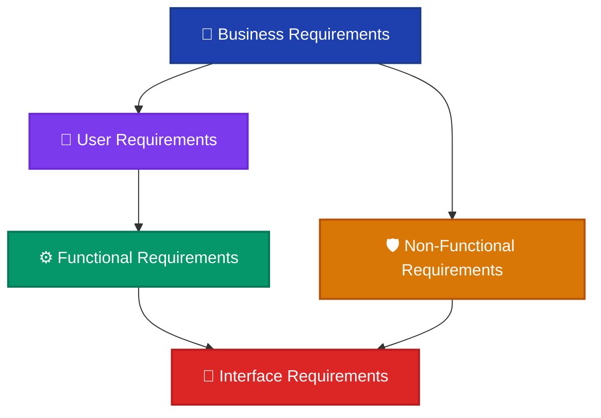
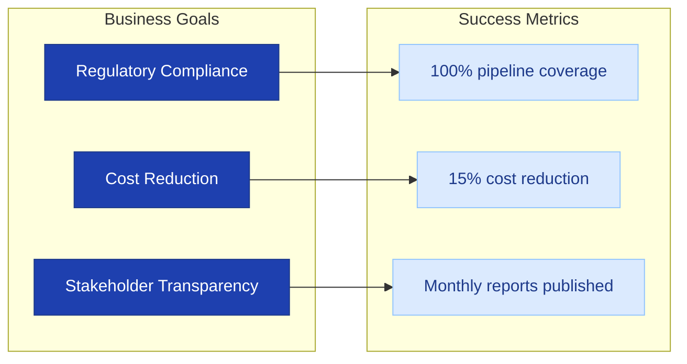
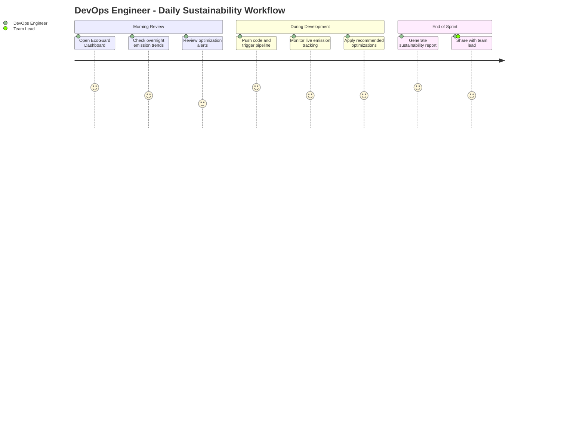
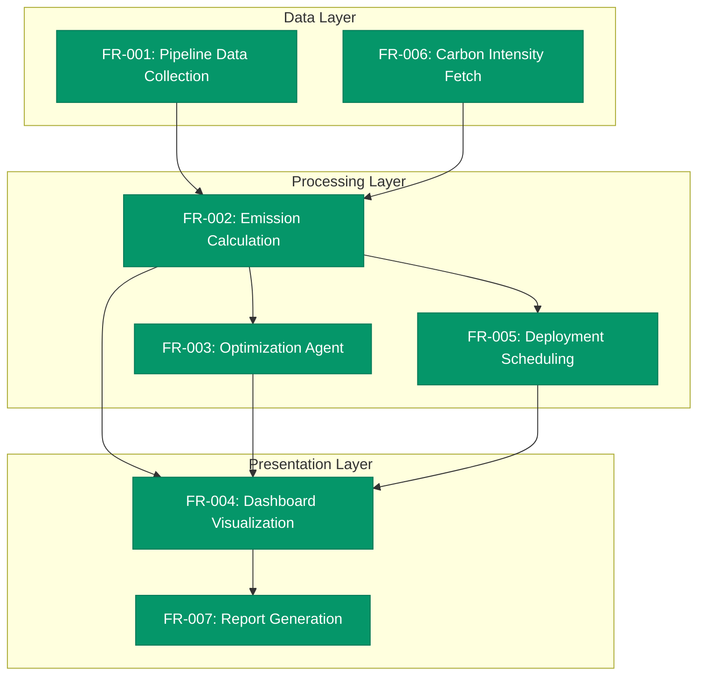
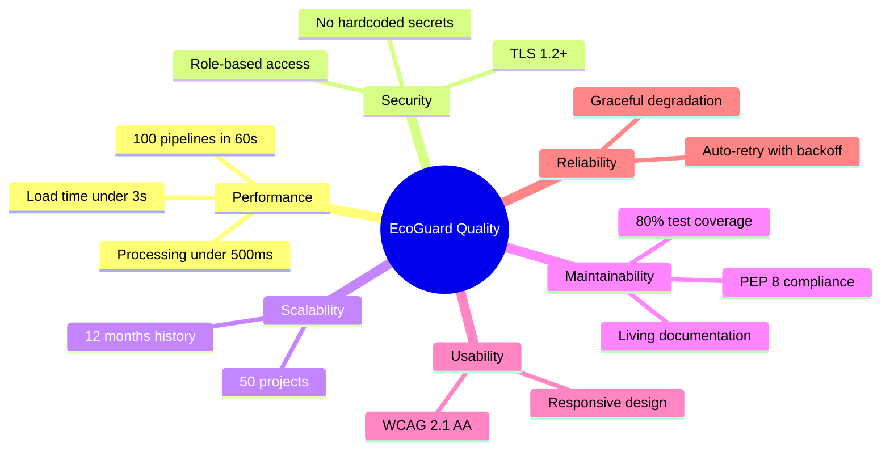
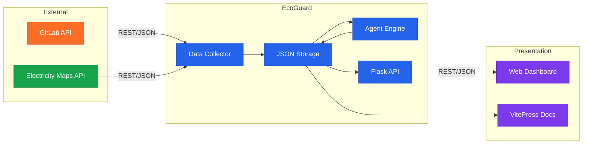
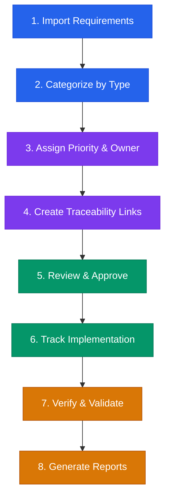

# Software Requirements Specification (SRS)

  
📄 SRS Document

  <h2 class="srs-hero-title">A comprehensive requirements specification for the EcoGuard sustainability platform</h2>
  

    This document defines every layer of requirements — from high-level business goals down to interface contracts — following IEEE 830 standards and managed through <strong>OSRMT</strong> (Open-Source Requirements Management Tool).
  

---

## 📐 Requirements Hierarchy

The diagram below illustrates how the five requirement types relate to each other, flowing from strategic business needs down to technical interface contracts.

Each level adds specificity. Business Requirements define **why** the system exists, User Requirements define **what** users need, Functional Requirements define **how** the system behaves, Non-Functional Requirements define **how well** it performs, and Interface Requirements define **how it connects** to external systems.

---

## 🏢 1. Business Requirements

Business requirements capture the high-level objectives that justify the project's existence. They are defined by executive stakeholders and drive every downstream decision.

  <h3>BR-001: Sustainability Compliance</h3>
  
<strong>Description:</strong> EcoGuard shall enable organizations to measure, track, and report the carbon footprint of their CI/CD pipelines in compliance with emerging EU sustainability reporting directives.

  
<strong>Priority:</strong> Critical

  
<strong>Rationale:</strong> Regulatory bodies are increasingly requiring digital sustainability reporting. Failure to comply exposes organizations to legal and reputational risk.

  <h3>BR-002: Cost Optimization</h3>
  
<strong>Description:</strong> The platform shall identify resource inefficiencies in pipeline execution and recommend optimizations that reduce both compute costs and energy consumption by at least 15%.

  
<strong>Priority:</strong> High

  
<strong>Rationale:</strong> Cloud compute costs are a major operational expense. Aligning cost reduction with sustainability creates a dual incentive for adoption.

  <h3>BR-003: Transparent Reporting</h3>
  
<strong>Description:</strong> EcoGuard shall produce clear, auditable sustainability dashboards and reports suitable for both internal engineering teams and external stakeholders.

  
<strong>Priority:</strong> High

  
<strong>Rationale:</strong> Transparency builds trust with customers, investors, and regulatory bodies.

### Business Requirements Traceability

---

## 👤 2. User Requirements

User requirements describe the system from the perspective of the people who will interact with it. They define expected behaviors in natural language.

  <h3>UR-001: View Emission Trends</h3>
  
<strong>Actor:</strong> DevOps Engineer

  
<strong>Description:</strong> As a DevOps engineer, I want to view CO₂ emission trends for my pipelines over the past 30 days so that I can identify which jobs are the biggest contributors.

  
<strong>Acceptance Criteria:</strong>

  <ul>
    <li>Dashboard displays a line chart of daily emissions</li>
    <li>User can filter by project, branch, or job name</li>
    <li>Data refreshes within 5 minutes of pipeline completion</li>
  </ul>

  <h3>UR-002: Receive Optimization Alerts</h3>
  
<strong>Actor:</strong> Team Lead

  
<strong>Description:</strong> As a team lead, I want to receive alerts when a pipeline exceeds emission thresholds so that I can prioritize optimization before the next sprint.

  
<strong>Acceptance Criteria:</strong>

  <ul>
    <li>Configurable threshold per project (kg CO₂ per build)</li>
    <li>Alerts delivered via GitLab notification and email</li>
    <li>Alert includes specific job and recommended action</li>
  </ul>

  <h3>UR-003: Generate Compliance Reports</h3>
  
<strong>Actor:</strong> Sustainability Officer

  
<strong>Description:</strong> As a sustainability officer, I want to generate monthly compliance reports with one click so that I can submit them to regulatory bodies without manual data aggregation.

  
<strong>Acceptance Criteria:</strong>

  <ul>
    <li>Report includes total emissions, energy usage, and trend analysis</li>
    <li>Exportable as PDF and CSV</li>
    <li>Signed with generation timestamp for audit trail</li>
  </ul>

### User Journey Map

---

## ⚙️ 3. Functional Requirements

Functional requirements define the specific behaviors, features, and functions the system must perform.

  <h3>FR-001: Pipeline Data Collection</h3>
  
<strong>Traces to:</strong> UR-001, BR-001

  
<strong>Description:</strong> The system shall automatically collect job-level metadata (duration, runner type, resource usage) from GitLab CI/CD pipelines via the GitLab REST API.

  
<strong>Input:</strong> GitLab project ID, API token

  
<strong>Output:</strong> Structured JSON containing job metrics per pipeline run

  
<strong>Processing:</strong>

  <ol>
    <li>Query <code>/api/v4/projects/:id/pipelines</code> for recent pipelines</li>
    <li>For each pipeline, fetch individual job details</li>
    <li>Extract duration, runner tags, artifacts size, and status</li>
    <li>Store normalized data in <code>dashboards/data/</code></li>
  </ol>

  <h3>FR-002: Carbon Emission Calculation</h3>
  
<strong>Traces to:</strong> UR-001, BR-001

  
<strong>Description:</strong> The system shall calculate CO₂ emissions for each pipeline job using the formula:

  

    CO₂ (kg) = Energy (kWh) × Carbon Intensity (gCO₂/kWh) ÷ 1000
  

  
Where Energy = Duration (hours) × Power Draw (kW) and Carbon Intensity is fetched from the Electricity Maps API for the runner's region.

  <h3>FR-003: Optimization Agent</h3>
  
<strong>Traces to:</strong> UR-002, BR-002

  
<strong>Description:</strong> The system shall analyze pipeline efficiency and generate actionable recommendations including:

  <ul>
    <li>Parallelization opportunities for sequential jobs</li>
    <li>Cache optimization for repeated dependency installations</li>
    <li>Runner right-sizing based on actual CPU/memory utilization</li>
    <li>Scheduling non-urgent jobs during low carbon intensity windows</li>
  </ul>

  <h3>FR-004: Dashboard Visualization</h3>
  
<strong>Traces to:</strong> UR-001, UR-003, BR-003

  
<strong>Description:</strong> The system shall render interactive dashboards with the following views:

  <ul>
    <li>Daily/weekly/monthly emission trend charts</li>
    <li>Per-project and per-job breakdowns</li>
    <li>Sustainability goal progress indicators</li>
    <li>Carbon intensity heatmap by time of day</li>
  </ul>

  <h3>FR-005: Eco-Friendly Deployment Scheduling</h3>
  
<strong>Traces to:</strong> BR-001, BR-002

  
<strong>Description:</strong> The system shall recommend optimal deployment windows based on forecasted grid carbon intensity. When carbon intensity exceeds a configurable threshold, the system shall suggest delaying non-critical deployments.

### Functional Decomposition

---

## 🛡️ 4. Non-Functional Requirements (NFRs)

Non-functional requirements define the quality attributes and constraints that the system must satisfy.

  

    <h3>⚡ Performance</h3>
    <table>
      <tr><td><strong>NFR-001</strong></td><td>Dashboard shall load within 3 seconds on a standard broadband connection</td></tr>
      <tr><td><strong>NFR-002</strong></td><td>Data collection for 100 pipelines shall complete within 60 seconds</td></tr>
      <tr><td><strong>NFR-003</strong></td><td>Emission calculations shall process within 500ms per job</td></tr>
    </table>
  

  

    <h3>🔒 Security</h3>
    <table>
      <tr><td><strong>NFR-004</strong></td><td>GitLab API tokens shall be stored as environment variables, never in source code</td></tr>
      <tr><td><strong>NFR-005</strong></td><td>All external API calls shall use HTTPS/TLS 1.2+</td></tr>
      <tr><td><strong>NFR-006</strong></td><td>Dashboard access shall respect GitLab project-level permissions</td></tr>
    </table>
  

  

    <h3>📈 Scalability</h3>
    <table>
      <tr><td><strong>NFR-007</strong></td><td>System shall handle data from up to 50 concurrent GitLab projects</td></tr>
      <tr><td><strong>NFR-008</strong></td><td>Historical data storage shall support at least 12 months of metrics</td></tr>
    </table>
  

  

    <h3>🔧 Maintainability</h3>
    <table>
      <tr><td><strong>NFR-009</strong></td><td>Codebase shall maintain a minimum of 80% test coverage</td></tr>
      <tr><td><strong>NFR-010</strong></td><td>All Python modules shall follow PEP 8 style guidelines</td></tr>
      <tr><td><strong>NFR-011</strong></td><td>Documentation shall be updated alongside every feature change</td></tr>
    </table>
  

  

    <h3>♿ Usability</h3>
    <table>
      <tr><td><strong>NFR-012</strong></td><td>Dashboard shall be responsive and usable on screens from 375px to 2560px</td></tr>
      <tr><td><strong>NFR-013</strong></td><td>Color palette shall meet WCAG 2.1 AA contrast standards</td></tr>
    </table>
  

  

    <h3>🔄 Reliability</h3>
    <table>
      <tr><td><strong>NFR-014</strong></td><td>System shall gracefully degrade if external APIs are unavailable</td></tr>
      <tr><td><strong>NFR-015</strong></td><td>Failed data collection jobs shall retry up to 3 times with exponential backoff</td></tr>
    </table>
  

### NFR Quality Model

---

## 🔌 5. Interface Requirements

Interface requirements define how EcoGuard connects to external systems, APIs, and user-facing surfaces.

### 5.1 External API Interfaces

  <h3>IR-001: GitLab REST API</h3>
  
<strong>Direction:</strong> EcoGuard → GitLab

  
<strong>Protocol:</strong> HTTPS REST (JSON)

  
<strong>Authentication:</strong> Personal Access Token (PAT) via <code>GITLAB_TOKEN</code> environment variable

  
<strong>Endpoints Used:</strong>

  <ul>
    <li><code>GET /api/v4/projects/:id/pipelines</code> — List pipeline runs</li>
    <li><code>GET /api/v4/projects/:id/pipelines/:pipeline_id/jobs</code> — Job details</li>
    <li><code>GET /api/v4/projects/:id/issues</code> — Compliance issue tracking</li>
    <li><code>POST /api/v4/projects/:id/issues</code> — Create optimization recommendations</li>
  </ul>
  
<strong>Rate Limits:</strong> Respects GitLab rate limit headers; implements retry with <code>Retry-After</code> header.

  <h3>IR-002: Electricity Maps API</h3>
  
<strong>Direction:</strong> EcoGuard → Electricity Maps

  
<strong>Protocol:</strong> HTTPS REST (JSON)

  
<strong>Authentication:</strong> API key via <code>ELECTRICITY_MAPS_API_KEY</code> environment variable

  
<strong>Endpoints Used:</strong>

  <ul>
    <li><code>GET /v3/carbon-intensity/latest</code> — Current carbon intensity by zone</li>
    <li><code>GET /v3/carbon-intensity/forecast</code> — 72-hour forecast for deployment scheduling</li>
  </ul>
  
<strong>Fallback:</strong> If the API is unavailable, use a default carbon intensity of 475 gCO₂/kWh (global average).

### 5.2 Internal Interfaces

  <h3>IR-003: Flask API Server</h3>
  
<strong>Direction:</strong> Dashboard ↔ Backend

  
<strong>Protocol:</strong> HTTP REST (JSON)

  
<strong>Endpoints:</strong>

  <ul>
    <li><code>GET /api/metrics/daily</code> — Daily metrics summary</li>
    <li><code>GET /api/metrics/weekly</code> — Weekly metrics summary</li>
    <li><code>GET /api/metrics/monthly</code> — Monthly metrics summary</li>
    <li><code>GET /api/summary</code> — Overall project summary</li>
    <li><code>GET /api/goals</code> — Sustainability goal progress</li>
  </ul>

### 5.3 User Interface

  <h3>IR-004: Web Dashboard</h3>
  
<strong>Technology:</strong> HTML5, CSS3, JavaScript with Chart.js / D3.js

  
<strong>Supported Browsers:</strong> Chrome 90+, Firefox 88+, Safari 14+, Edge 90+

  
<strong>Responsive Breakpoints:</strong>

  <ul>
    <li>Mobile: 375px – 768px</li>
    <li>Tablet: 769px – 1024px</li>
    <li>Desktop: 1025px+</li>
  </ul>

### Interface Architecture

---

## 🔧 Requirements Management with OSRMT

**OSRMT (Open-Source Requirements Management Tool)** is used to gather, organize, trace, and validate all requirements throughout the project lifecycle.

### Why OSRMT?

  

    <h3>📋 Structured Capture</h3>
    
OSRMT provides a tree-based hierarchy to organize requirements into categories (Business, User, Functional, NFR, Interface) with unique identifiers for traceability.

  

  

    <h3>🔗 Traceability Matrix</h3>
    
Every requirement is linked to its parent (upstream traceability) and its implementation artifacts like test cases and code modules (downstream traceability).

  

  

    <h3>📊 Change Tracking</h3>
    
OSRMT logs every modification with timestamps, authors, and justifications — creating a complete audit trail for compliance and review.

  

  

    <h3>✅ Validation & Verification</h3>
    
Requirements are tagged with validation status (Draft → Reviewed → Approved → Implemented → Verified) to track progress through the lifecycle.

  

### OSRMT Workflow for EcoGuard

### Full Traceability Matrix

| Req ID | Type | Traces To | Status | Owner |
|---|---|---|---|---|
| BR-001 | Business | UR-001, UR-003 | Approved | Product Owner |
| BR-002 | Business | UR-002 | Approved | Product Owner |
| BR-003 | Business | UR-003 | Approved | Product Owner |
| UR-001 | User | FR-001, FR-002, FR-004 | Approved | DevOps Lead |
| UR-002 | User | FR-003 | Approved | DevOps Lead |
| UR-003 | User | FR-004, FR-007 | Approved | Sustainability Officer |
| FR-001 | Functional | IR-001 | Implemented | Backend Dev |
| FR-002 | Functional | IR-001, IR-002 | Implemented | Backend Dev |
| FR-003 | Functional | — | Implemented | Backend Dev |
| FR-004 | Functional | IR-003, IR-004 | Implemented | Frontend Dev |
| FR-005 | Functional | IR-002 | Implemented | Backend Dev |
| NFR-001 | Non-Functional | FR-004 | Verified | QA Lead |
| NFR-004 | Non-Functional | IR-001, IR-002 | Verified | Security Lead |
| IR-001 | Interface | FR-001, FR-002 | Verified | Backend Dev |
| IR-002 | Interface | FR-002, FR-005 | Verified | Backend Dev |

---

## 📊 Requirements Summary

  

    3
    Business Requirements
  

  

    3
    User Requirements
  

  

    5+
    Functional Requirements
  

  

    15
    Non-Functional Requirements
  

  

    4
    Interface Requirements
  

