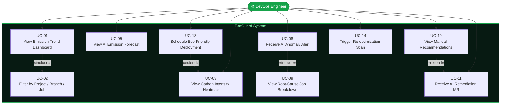
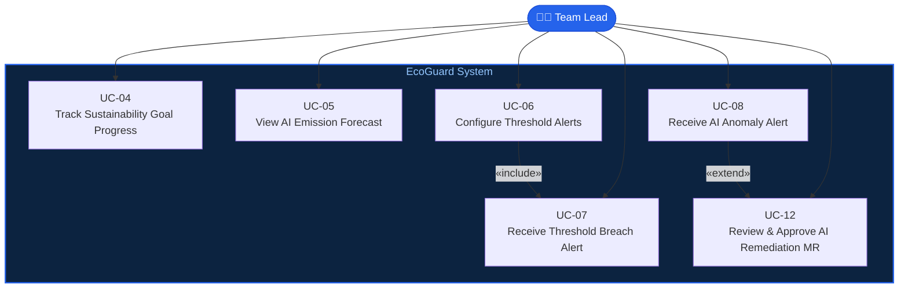
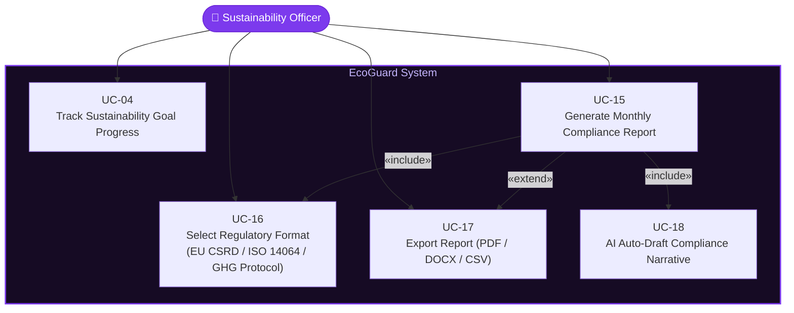
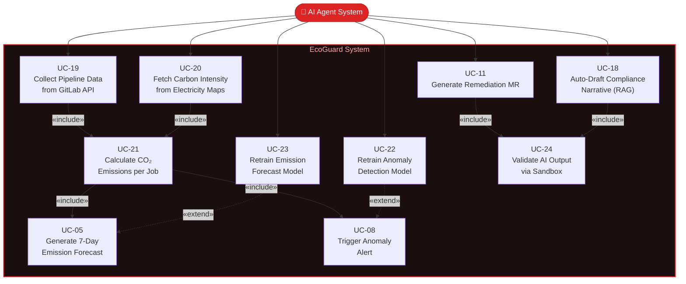

# Use Case Diagram

  
📐 System Modeling

  <h2 class="ucd-title">EcoGuard — Use Case Analysis</h2>
  

    A complete behavioral model of EcoGuard's actors and system interactions, structured from stakeholder goals down to technical system boundaries.
  

---

## 👥 Actors

EcoGuard serves four distinct actors, each with a different level of system interaction and concern.

  

    
⚙️

    <h3>DevOps Engineer</h3>
    
Primary User

    
Manages CI/CD pipelines day-to-day. Monitors emissions, applies AI-generated optimizations, and reviews anomaly alerts to improve pipeline efficiency.

    <ul>
      <li>Views live emission dashboards</li>
      <li>Reviews & applies optimization MRs</li>
      <li>Configures pipeline thresholds</li>
      <li>Schedules eco-friendly deployments</li>
    </ul>
  

  

    
🧑‍💼

    <h3>Team Lead</h3>
    
Supervisor

    
Oversees the team's collective pipeline sustainability posture. Approves AI-generated merge requests and receives escalated anomaly alerts.

    <ul>
      <li>Receives threshold breach alerts</li>
      <li>Approves AI remediation MRs</li>
      <li>Reviews team-level emission trends</li>
      <li>Sets project sustainability goals</li>
    </ul>
  

  

    
🌿

    <h3>Sustainability Officer</h3>
    
Compliance Owner

    
Responsible for regulatory compliance reporting. Generates AI-assisted audit reports for EU CSRD, ISO 14064, and GHG Protocol requirements.

    <ul>
      <li>Generates compliance reports</li>
      <li>Exports PDF / DOCX / CSV reports</li>
      <li>Tracks sustainability goal progress</li>
      <li>Submits to regulatory bodies</li>
    </ul>
  

  

    
🤖

    <h3>AI Agent System</h3>
    
Automated Actor

    
An autonomous subsystem that continuously monitors pipeline data, detects anomalies, forecasts emissions, and generates code-level optimization patches.

    <ul>
      <li>Forecasts future emissions (ML)</li>
      <li>Detects pipeline anomalies</li>
      <li>Generates remediation MRs</li>
      <li>Auto-drafts compliance reports</li>
    </ul>
  

---

## 📋 Use Case Inventory

All use cases are listed below, grouped by functional domain, before being visualized in the diagrams.

  

    <h3>📊 Monitoring & Visibility</h3>
    

      
UC-01View Emission Trend DashboardDevOps Engineer

      
UC-02Filter Emissions by Project / Branch / JobDevOps Engineer

      
UC-03View Carbon Intensity HeatmapDevOps Engineer

      
UC-04Track Sustainability Goal ProgressTeam Lead · Sustainability Officer

      
UC-05View AI Emission Forecast (7-day)DevOps Engineer · Team Lead

    

  

  

    <h3>🚨 Alerting & Anomaly Detection</h3>
    

      
UC-06Configure Emission Threshold AlertsTeam Lead

      
UC-07Receive Threshold Breach NotificationTeam Lead

      
UC-08Receive AI Anomaly Detection AlertDevOps Engineer · Team Lead

      
UC-09View Root-Cause Job BreakdownDevOps Engineer

    

  

  

    <h3>🔧 Optimization & Remediation</h3>
    

      
UC-10View Manual Optimization RecommendationsDevOps Engineer

      
UC-11Receive AI-Generated Remediation MRDevOps Engineer

      
UC-12Review & Approve AI Remediation MRTeam Lead

      
UC-13Schedule Eco-Friendly Deployment WindowDevOps Engineer

      
UC-14Trigger Manual Re-optimization ScanDevOps Engineer

    

  

  

    <h3>📄 Reporting & Compliance</h3>
    

      
UC-15Generate Monthly Compliance ReportSustainability Officer

      
UC-16Select Regulatory Format (EU/ISO/GHG)Sustainability Officer

      
UC-17Export Report (PDF / DOCX / CSV)Sustainability Officer

      
UC-18AI Auto-Draft Compliance NarrativeAI Agent System

    

  

  

    <h3>⚙️ System & Data Operations</h3>
    

      
UC-19Collect Pipeline Data from GitLab APIAI Agent System

      
UC-20Fetch Carbon Intensity from Electricity MapsAI Agent System

      
UC-21Calculate CO₂ Emissions per JobAI Agent System

      
UC-22Retrain Anomaly Detection ModelAI Agent System

      
UC-23Retrain Emission Forecast ModelAI Agent System

      
UC-24Validate AI Output via SandboxAI Agent System

    

  

---

## 🗺️ Use Case Diagram — Overview

The master diagram below shows all actors and their relationships to the EcoGuard system boundary.

```mermaid
graph LR
  %% ── Actors ──────────────────────────────
  DevOps(["⚙️ DevOps\nEngineer"])
  Lead(["🧑‍💼 Team\nLead"])
  Officer(["🌿 Sustainability\nOfficer"])
  AI(["🤖 AI Agent\nSystem"])

  %% ── System Boundary ─────────────────────
  subgraph EcoGuard ["🌍  EcoGuard System"]

    subgraph MON ["📊 Monitoring & Visibility"]
      UC01["UC-01 View Emission Trends"]
      UC02["UC-02 Filter by Project/Branch/Job"]
      UC03["UC-03 Carbon Intensity Heatmap"]
      UC04["UC-04 Track Goal Progress"]
      UC05["UC-05 View AI Forecast (7-day)"]
    end

    subgraph ALERT ["🚨 Alerting & Anomaly Detection"]
      UC06["UC-06 Configure Threshold Alerts"]
      UC07["UC-07 Receive Threshold Alert"]
      UC08["UC-08 Receive AI Anomaly Alert"]
      UC09["UC-09 View Root-Cause Breakdown"]
    end

    subgraph OPT ["🔧 Optimization & Remediation"]
      UC10["UC-10 Manual Recommendations"]
      UC11["UC-11 Receive AI Remediation MR"]
      UC12["UC-12 Approve AI Remediation MR"]
      UC13["UC-13 Schedule Eco Deployment"]
      UC14["UC-14 Trigger Re-optimization Scan"]
    end

    subgraph RPT ["📄 Reporting & Compliance"]
      UC15["UC-15 Generate Compliance Report"]
      UC16["UC-16 Select Regulatory Format"]
      UC17["UC-17 Export Report"]
      UC18["UC-18 AI Auto-Draft Narrative"]
    end

    subgraph SYS ["⚙️ System Operations"]
      UC19["UC-19 Collect GitLab Pipeline Data"]
      UC20["UC-20 Fetch Carbon Intensity"]
      UC21["UC-21 Calculate CO₂ per Job"]
      UC22["UC-22 Retrain Anomaly Model"]
      UC23["UC-23 Retrain Forecast Model"]
      UC24["UC-24 Validate AI Output (Sandbox)"]
    end

  end

  %% ── DevOps Associations ──────────────────
  DevOps --> UC01
  DevOps --> UC02
  DevOps --> UC03
  DevOps --> UC05
  DevOps --> UC08
  DevOps --> UC09
  DevOps --> UC10
  DevOps --> UC11
  DevOps --> UC13
  DevOps --> UC14

  %% ── Team Lead Associations ───────────────
  Lead --> UC04
  Lead --> UC05
  Lead --> UC06
  Lead --> UC07
  Lead --> UC08
  Lead --> UC12

  %% ── Sustainability Officer Associations ──
  Officer --> UC04
  Officer --> UC15
  Officer --> UC16
  Officer --> UC17

  %% ── AI Agent Associations ────────────────
  AI --> UC05
  AI --> UC08
  AI --> UC11
  AI --> UC18
  AI --> UC19
  AI --> UC20
  AI --> UC21
  AI --> UC22
  AI --> UC23
  AI --> UC24

  %% ── Styling ──────────────────────────────
  style EcoGuard fill:#0f172a,stroke:#334155,stroke-width:2px,color:#f1f5f9
  style MON fill:#0c2340,stroke:#2563eb,stroke-width:1.5px,color:#93c5fd
  style ALERT fill:#1c1008,stroke:#d97706,stroke-width:1.5px,color:#fde68a
  style OPT fill:#071a12,stroke:#16a34a,stroke-width:1.5px,color:#86efac
  style RPT fill:#160b24,stroke:#7c3aed,stroke-width:1.5px,color:#c4b5fd
  style SYS fill:#1a0e0e,stroke:#dc2626,stroke-width:1.5px,color:#fca5a5
```

---

## 🎯 Detailed Use Case Views

### 1️⃣ DevOps Engineer — Daily Workflow

### 2️⃣ Team Lead — Oversight & Approval Workflow

### 3️⃣ Sustainability Officer — Compliance Workflow

### 4️⃣ AI Agent System — Autonomous Operations

---

## 🔗 Use Case Relationships Summary

| Relationship | From | To | Type |
|---|---|---|---|
| UC-01 → UC-02 | View Dashboard | Filter by Criteria | `«include»` |
| UC-06 → UC-07 | Configure Alert | Receive Alert | `«include»` |
| UC-08 → UC-12 | AI Anomaly Alert | Approve Remediation MR | `«extend»` |
| UC-10 → UC-11 | Manual Recs | AI Remediation MR | `«extend»` |
| UC-13 → UC-03 | Eco Scheduling | Carbon Intensity Heatmap | `«extend»` |
| UC-15 → UC-16 | Generate Report | Select Format | `«include»` |
| UC-15 → UC-18 | Generate Report | AI Auto-Draft Narrative | `«include»` |
| UC-15 → UC-17 | Generate Report | Export Report | `«extend»` |
| UC-19 → UC-21 | Collect Data | Calculate Emissions | `«include»` |
| UC-20 → UC-21 | Fetch Carbon Intensity | Calculate Emissions | `«include»` |
| UC-21 → UC-05 | Calculate Emissions | AI Forecast | `«include»` |
| UC-21 → UC-08 | Calculate Emissions | Anomaly Alert | `«include»` |
| UC-11 → UC-24 | Generate MR | Sandbox Validation | `«include»` |
| UC-18 → UC-24 | Auto-Draft Report | Sandbox Validation | `«include»` |

---

## 📊 Actor Coverage Matrix

  

    

      
Use Case

      
⚙️ DevOps

      
🧑‍💼 Lead

      
🌿 Officer

      
🤖 AI Agent

    

    

UC-01 View Emission Trends

✅

—

—

—

    

UC-02 Filter Emissions

✅

—

—

—

    

UC-03 Carbon Intensity Heatmap

✅

—

—

—

    

UC-04 Track Goal Progress

—

✅

✅

—

    

UC-05 AI Emission Forecast

✅

✅

—

✅

    

UC-06 Configure Alerts

—

✅

—

—

    

UC-07 Threshold Alert

—

✅

—

—

    

UC-08 AI Anomaly Alert

✅

✅

—

✅

    

UC-09 Root-Cause Breakdown

✅

—

—

—

    

UC-10 Manual Recommendations

✅

—

—

—

    

UC-11 AI Remediation MR

✅

—

—

✅

    

UC-12 Approve Remediation MR

—

✅

—

—

    

UC-13 Eco Deployment Schedule

✅

—

—

—

    

UC-14 Re-optimization Scan

✅

—

—

—

    

UC-15 Generate Compliance Report

—

—

✅

—

    

UC-16 Select Regulatory Format

—

—

✅

—

    

UC-17 Export Report

—

—

✅

—

    

UC-18 AI Auto-Draft Narrative

—

—

—

✅

    

UC-19 Collect GitLab Data

—

—

—

✅

    

UC-20 Fetch Carbon Intensity

—

—

—

✅

    

UC-21 Calculate CO₂ per Job

—

—

—

✅

    

UC-22 Retrain Anomaly Model

—

—

—

✅

    

UC-23 Retrain Forecast Model

—

—

—

✅

    

UC-24 Validate via Sandbox

—

—

—

✅

    

      
<strong>Total Use Cases</strong>

      
<strong>10</strong>

      
<strong>6</strong>

      
<strong>5</strong>

      
<strong>10</strong>

    

  

